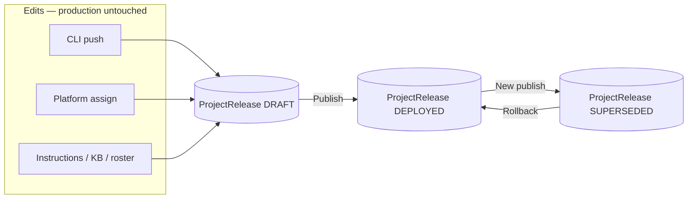
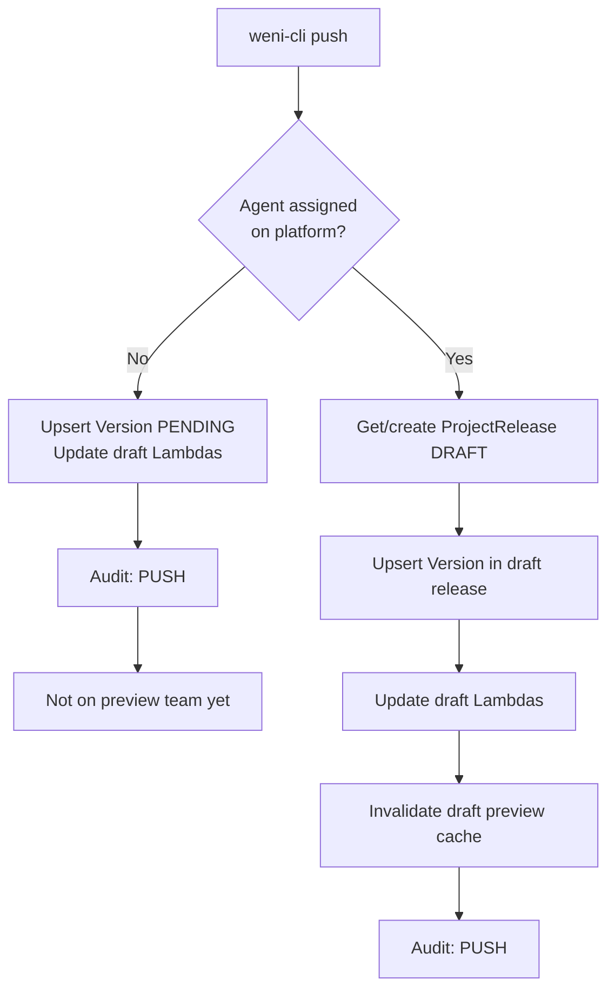
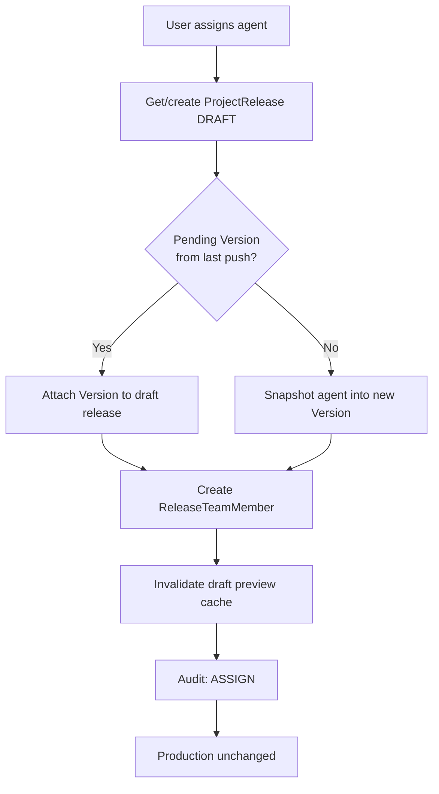
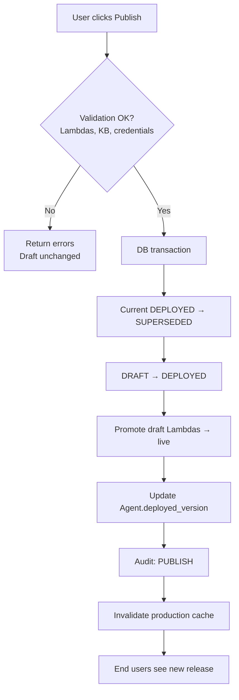
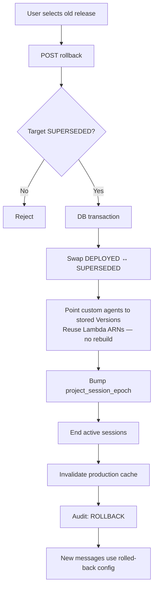
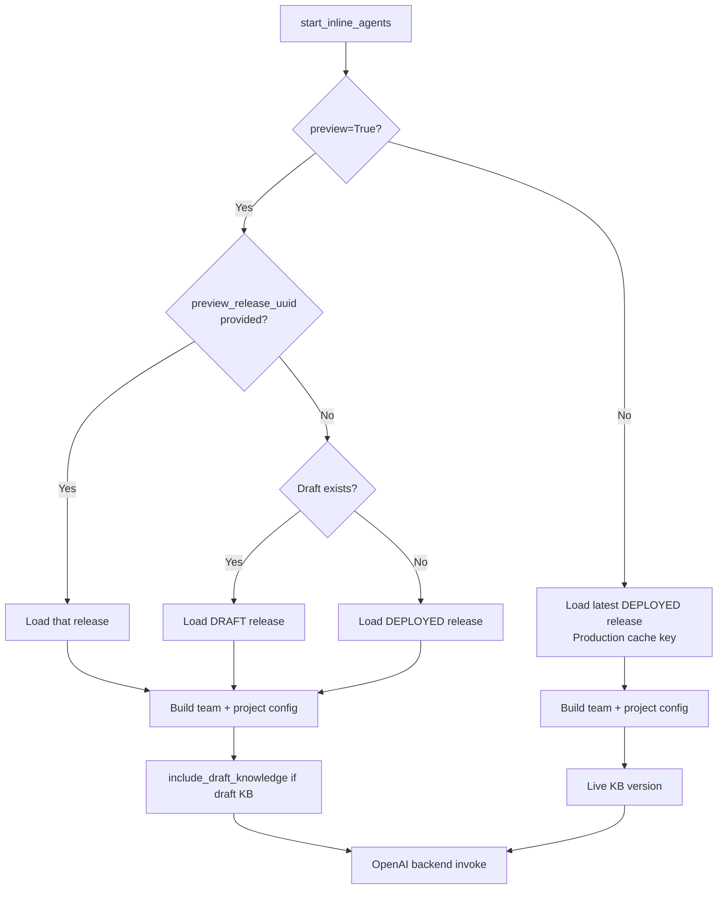
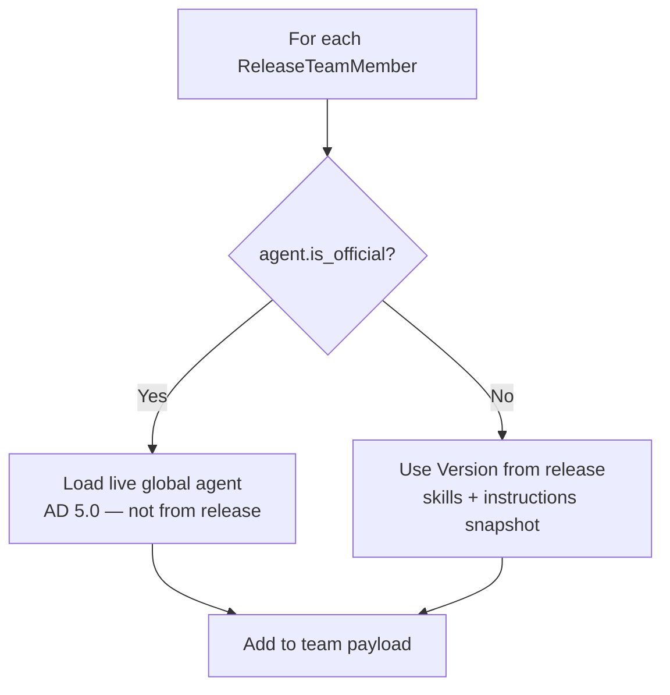
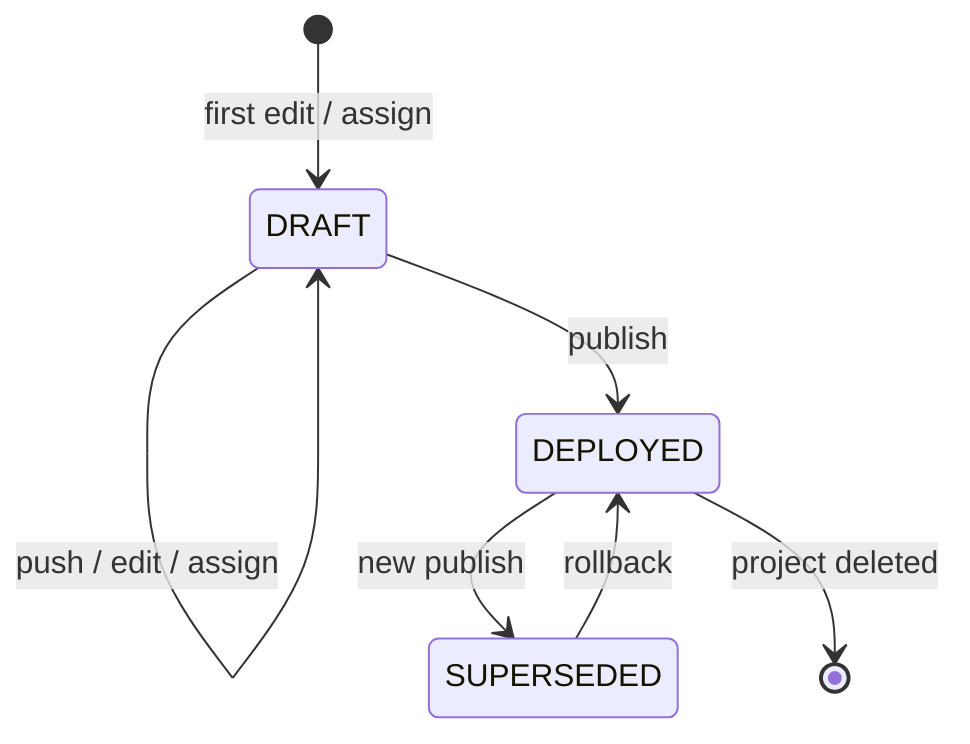

# Agent Versioning Plan — Draft / Preview / Deploy

**Last updated:** July 2026  
**Scope:** Inline agents → `start_inline_agents`  
**Status:** Plan only — no implementation

---

## Goal

Single project-level versioning solution: **custom** agent and project config changes go to a **draft**, user **publishes** when ready, production never updates until then. Preview uses draft if it exists, else live (AD 9.0).

Production path (`preview=False`) — no extra latency on the hot path.

---

## Requirements coverage


| Requirement                                              | Plan                                                          |
| -------------------------------------------------------- | ------------------------------------------------------------- |
| Changes not published directly to production             | Draft `ProjectRelease` + publish gate                         |
| Publishing with releases                                 | Publish = promote draft → `DEPLOYED`                          |
| Full versioning (instructions, KB, manager*, agent code) | Snapshotted on release; *project manager choice only (AD 4.0) |
| Rollback from UI/API                                     | `POST .../releases/{uuid}/rollback` — pointer swap, fast      |
| State fully restarted on rollback                        | Session purge + cache invalidation (see Rollback)             |
| Draft can be changed before publish                      | Mutable `DRAFT` release only                                  |
| No git-like granularity / branches / merges              | One draft per project, no diffs                               |
| No diff UI between releases                              | Metadata only (who/when/label)                                |
| Trackable & auditable                                    | `ReleaseAuditEvent`                                           |
| User publishes explicitly                                | No auto-publish on push                                       |
| One versioning solution                                  | `ProjectRelease` for all project-scoped config                |
| Simple & scalable                                        | Pointer swap + immutable snapshots                            |
| Rollback almost instant                                  | Re-promote superseded release, no Lambda rebuild              |
| Publish only when 100% ready                             | Pre-publish validation; atomic transaction                    |


---


## Architectural decisions


| ID  | Decision                                                                                                                                                   |
| --- | ---------------------------------------------------------------------------------------------------------------------------------------------------------- |
| 1.0 | Push conflicts on **custom** agents are the developer’s responsibility                                                                                     |
| 1.1 | Code/version management scope is the **customer’s** responsibility (business)                                                                              |
| 2.0 | No KB/instruction **merge/conflict resolution** — use **edit locks** + “someone is editing” notifications                                                  |
| 3.0 | Product owns versioning control end-to-end (audit, publish, rollback)                                                                                      |
| 4.0 | **Global** `ManagerAgent` catalog is **not** snapshotted — only **project** manager choice (`project.manager_agent` uuid) and project provider credentials |
| 5.0 | **Official agents** are **not** versioned inside a project release — they stay global/live so VTEX can update them                                         |
| 6.0 | **Publish** = create the live release from draft (draft → `DEPLOYED`, previous live → `SUPERSEDED`)                                                        |
| 7.0 | Custom agent **push** → draft only, never auto-production                                                                                                  |
| 8.0 | **Push** is an auditable action, **not** a release (pending `Version` until assign + draft release)                                                        |
| 9.0 | **Preview:** draft if exists, else live (production release)                                                                                               |


---


## Recommended: `ProjectRelease`

One **mutable draft** per project. **Custom** agents and project config accumulate there after assign. **Publish** validates, promotes atomically, supersedes previous live release.

**Official agents** on the team always resolve from **live global** definition at runtime — not from the release snapshot (AD 5.0).

```text
Push custom agent (unassigned)  →  pending Version + draft Lambdas (not in release)
Assign on platform            →  draft release + ReleaseTeamMember + Version
Push / edit instructions / KB →  upsert same draft release
Publish (when ready)          →  draft → live; supersede old live
Rollback                      →  re-promote chosen superseded release (fast)
Preview                       →  draft if exists, else live; optional pick superseded for testing
```

---


## Flowcharts


### 1. Release lifecycle (high level)




### 2. CLI push (custom agent)




### 3. Platform assign (custom agent)




### 4. Publish




### 5. Rollback




### 6. `start_inline_agents` — which release?




### 7. Team member config (official vs custom)




### 8. Release states




---


### Models

```python
from uuid import uuid4

from django.conf import settings
from django.contrib.postgres.fields import ArrayField
from django.db import models

from nexus.projects.models import Project


class ProjectRelease(models.Model):
    """Project-scoped release. One DRAFT (mutable). DEPLOYED/SUPERSEDED are immutable snapshots."""

    DRAFT = "draft"
    DEPLOYED = "deployed"
    SUPERSEDED = "superseded"

    STATUS_CHOICES = (
        (DRAFT, "Draft"),
        (DEPLOYED, "Deployed"),
        (SUPERSEDED, "Superseded"),
    )

    uuid = models.UUIDField(default=uuid4, unique=True)
    project = models.ForeignKey(Project, on_delete=models.CASCADE, related_name="agent_releases")
    status = models.CharField(max_length=20, choices=STATUS_CHOICES, default=DRAFT)
    label = models.CharField(max_length=255, blank=True, help_text="Optional display name after publish")

    created_on = models.DateTimeField(auto_now_add=True)
    updated_on = models.DateTimeField(auto_now=True)
    published_at = models.DateTimeField(null=True, blank=True)

    created_by = models.ForeignKey(
        settings.AUTH_USER_MODEL, on_delete=models.SET_NULL, null=True, blank=True, related_name="created_agent_releases"
    )
    published_by = models.ForeignKey(
        settings.AUTH_USER_MODEL, on_delete=models.SET_NULL, null=True, blank=True, related_name="published_agent_releases"
    )

    # Versioned project config (NOT global ManagerAgent rows — AD 4.0)
    content_base_instructions = models.JSONField(default=list, blank=True)
    knowledge_base_version = models.CharField(max_length=32, default="1")
    project_config = models.JSONField(
        default=dict,
        blank=True,
        help_text="Project-only: manager_agent_uuid, provider credentials ref, guardrail id, "
        "human_support, formatter fields, inline_agent_config, etc.",
    )

    class Meta:
        constraints = [
            models.UniqueConstraint(
                fields=["project"],
                condition=models.Q(status="draft"),
                name="unique_draft_release_per_project",
            ),
        ]


class Version(models.Model):
    """Custom agent snapshot only (agent.is_official=False). Official agents never get a release-linked Version."""

    PENDING = "pending"
    DRAFT = "draft"
    DEPLOYED = "deployed"
    SUPERSEDED = "superseded"

    STATUS_CHOICES = (
        (PENDING, "Pending"),
        (DRAFT, "Draft"),
        (DEPLOYED, "Deployed"),
        (SUPERSEDED, "Superseded"),
    )

    skills = ArrayField(models.JSONField())
    display_skills = ArrayField(models.JSONField())
    agent = models.ForeignKey("Agent", on_delete=models.CASCADE, related_name="versions")
    created_on = models.DateTimeField(auto_now_add=True)

    release = models.ForeignKey(
        ProjectRelease,
        on_delete=models.CASCADE,
        related_name="agent_versions",
        null=True,
        blank=True,
    )
    status = models.CharField(max_length=20, choices=STATUS_CHOICES, default=PENDING)

    name = models.CharField(max_length=255)
    instruction = models.TextField()
    collaboration_instructions = models.TextField()
    backend_foundation_models = models.JSONField(default=dict)
    metadata = models.JSONField(default=dict, blank=True)

    created_by = models.ForeignKey(
        settings.AUTH_USER_MODEL, on_delete=models.SET_NULL, null=True, blank=True, related_name="created_inline_agent_versions"
    )

    class Meta:
        constraints = [
            models.UniqueConstraint(
                fields=["release", "agent"],
                condition=models.Q(release__isnull=False),
                name="unique_agent_version_per_release",
            ),
        ]


class ReleaseTeamMember(models.Model):
    """Roster in a release. Custom agents: pinned Version. Official agents: member row only (live config at runtime)."""

    release = models.ForeignKey(ProjectRelease, on_delete=models.CASCADE, related_name="team_members")
    agent = models.ForeignKey("Agent", on_delete=models.CASCADE, related_name="release_memberships")
    version = models.ForeignKey(
        Version,
        on_delete=models.SET_NULL,
        null=True,
        blank=True,
        related_name="+",
        help_text="Set for custom agents; null for official (AD 5.0)",
    )
    is_active = models.BooleanField(default=True)
    integrated_metadata = models.JSONField(default=dict, blank=True)

    class Meta:
        constraints = [
            models.UniqueConstraint(fields=["release", "agent"], name="unique_team_member_per_release"),
        ]


class ReleaseAuditEvent(models.Model):
    """Audit trail: push, assign, publish, rollback, KB/instruction edits (AD 3.0, 8.0)."""

    PUSH = "push"
    ASSIGN = "assign"
    UNASSIGN = "unassign"
    ACTIVATE = "activate"
    INSTRUCTION_EDIT = "instruction_edit"
    KB_EDIT = "kb_edit"
    PUBLISH = "publish"
    ROLLBACK = "rollback"

    ACTION_CHOICES = (
        (PUSH, "Push"),
        (ASSIGN, "Assign"),
        (UNASSIGN, "Unassign"),
        (ACTIVATE, "Activate"),
        (INSTRUCTION_EDIT, "Instruction edit"),
        (KB_EDIT, "Knowledge base edit"),
        (PUBLISH, "Publish"),
        (ROLLBACK, "Rollback"),
    )

    project = models.ForeignKey(Project, on_delete=models.CASCADE, related_name="release_audit_events")
    release = models.ForeignKey(ProjectRelease, on_delete=models.SET_NULL, null=True, blank=True)
    agent = models.ForeignKey("Agent", on_delete=models.SET_NULL, null=True, blank=True)
    action = models.CharField(max_length=32, choices=ACTION_CHOICES)
    actor = models.ForeignKey(settings.AUTH_USER_MODEL, on_delete=models.SET_NULL, null=True, blank=True)
    metadata = models.JSONField(default=dict, blank=True)
    created_on = models.DateTimeField(auto_now_add=True)


class ContentEditLock(models.Model):
    """Facilitator for AD 2.0 — no merge/conflict resolution."""

    project = models.ForeignKey(Project, on_delete=models.CASCADE, related_name="content_edit_locks")
    resource_type = models.CharField(max_length=64)  # e.g. content_base_instructions, knowledge_base
    locked_by = models.ForeignKey(settings.AUTH_USER_MODEL, on_delete=models.CASCADE)
    locked_at = models.DateTimeField(auto_now=True)
    expires_at = models.DateTimeField()

    class Meta:
        unique_together = ("project", "resource_type")


class Agent(models.Model):
    # ... existing fields ...

    deployed_version = models.ForeignKey(
        "Version",
        on_delete=models.SET_NULL,
        null=True,
        blank=True,
        related_name="+",
        help_text="Live custom agent snapshot. Ignored for is_official=True (AD 5.0).",
    )
```


### Push vs assign vs publish (AD 7.0, 8.0)


| Step                          | `ProjectRelease`                                                            | `ReleaseTeamMember`      | `Version`                    | Audit                          |
| ----------------------------- | --------------------------------------------------------------------------- | ------------------------ | ---------------------------- | ------------------------------ |
| CLI push (custom, unassigned) | —                                                                           | —                        | `PENDING` + draft Lambdas    | `PUSH`                         |
| Platform assign (custom)      | get/create `DRAFT`                                                          | create member            | pending → `DRAFT` in release | `ASSIGN`                       |
| CLI push (assigned custom)    | same draft                                                                  | —                        | upsert in draft              | `PUSH`                         |
| Instruction / KB edit         | upsert draft fields                                                         | —                        | —                            | `INSTRUCTION_EDIT` / `KB_EDIT` |
| **Publish**                   | `DRAFT` → `DEPLOYED`; old live → `SUPERSEDED`; new empty draft on next edit | promote                  | promote + prod Lambdas       | `PUBLISH`                      |
| **Rollback**                  | target `SUPERSEDED` → `DEPLOYED`; current → `SUPERSEDED`                    | copy from target release | pointer swap                 | `ROLLBACK`                     |


Official agent assign: `ReleaseTeamMember` only (no `Version`). Runtime reads live official agent + latest global tools.

### Team resolution at runtime

```python
def resolve_agent_config(member: ReleaseTeamMember, channel: str) -> dict:
    if member.agent.is_official:
        return load_live_official_agent(member.agent)  # global, AD 5.0
    version = member.version or member.agent.deployed_version
    return version_to_team_dict(version)
```


| Path               | Release                                         | Official agents    | Custom agents                 | Project config        |
| ------------------ | ----------------------------------------------- | ------------------ | ----------------------------- | --------------------- |
| Production         | Latest `DEPLOYED`                               | Live global        | Release `Version` (prod ARNs) | Release snapshot      |
| Preview (default)  | `DRAFT` if exists, else `DEPLOYED`              | Live global        | Draft or live `Version`       | From selected release |
| Preview (selector) | Any `DEPLOYED` / `SUPERSEDED` / `DRAFT` by uuid | Always live global | Snapshot from that release    | From that release     |


### Lambdas (custom agents only)


| Phase            | Naming                                                      |
| ---------------- | ----------------------------------------------------------- |
| Push / draft     | `{tool_key}-{agent_id}-draft`                               |
| Live (published) | `{tool_key}-{agent_id}`                                     |
| Publish          | Promote draft → live; validate first                        |
| Rollback         | Reuse ARNs stored in target release — **no rebuild** (fast) |


Published/superseded releases keep Lambda ARNs in `Version.skills` for instant rollback and historical preview.

### Publish gate (must not fail — atomic)

Before `DRAFT` → `DEPLOYED`:

1. All custom `ReleaseTeamMember` rows have a valid `Version` and draft Lambdas exist.
2. KB draft ingested if KB changed (or block publish until ready).
3. No missing credentials for custom agents in draft.
4. Single DB transaction: supersede old live → promote draft → promote Lambdas → write audit → enqueue cache invalidation.
5. On failure: **rollback transaction**, draft unchanged, return errors to UI.

After success: async warm production cache. Optional: create new empty `DRAFT` on next edit only (not automatically).

### Rollback (fast + state restart)

`POST /projects/{project_uuid}/releases/{release_uuid}/rollback`

1. Validate target is `SUPERSEDED` (or allow re-publish current live).
2. Transaction: swap `DEPLOYED` / `SUPERSEDED` statuses; update `Agent.deployed_version` for custom agents from target release.
3. Invalidate production team + project caches.
4. **State restart:** bump `project_session_epoch` (Redis); call `backend.end_session` for active project conversations / clear OpenAI session keys; document that in-flight turns may finish on old config, new turns use rolled-back release.
5. Audit `ROLLBACK`. No Lambda deploy — use stored ARNs.


### Preview (AD 9.0 + optional history)

Default: `preview_release_uuid = null` → draft if exists, else live (`DEPLOYED`).

Optional UI selector: list `GET /projects/{uuid}/releases` (draft, live, superseded) — simple labels only, **no diffs**.

```python
preview_release_uuid: str | None = None  # only when preview=True
```


### APIs


| Endpoint                                         | Purpose                                     |
| ------------------------------------------------ | ------------------------------------------- |
| `GET /projects/{uuid}/releases`                  | List draft / live / history (metadata only) |
| `POST /projects/{uuid}/publish`                  | Publish draft when validation passes        |
| `POST /projects/{uuid}/releases/{uuid}/rollback` | Fast rollback                               |
| `GET /projects/{uuid}/releases/audit`            | Change history                              |
| Preview message API                              | `preview_release_uuid` optional             |


### Cache


| Path                     | Key                                                                |
| ------------------------ | ------------------------------------------------------------------ |
| Production               | `project:{uuid}:team:{backend}` — always latest `DEPLOYED`         |
| Preview default          | draft or live team builder                                         |
| Preview specific release | `project:{uuid}:team:preview:{release_uuid}:{backend}` or no cache |


Push / draft edits invalidate draft preview cache only. Publish / rollback invalidate production cache.

### Out of scope (explicit)

- Git-like branches, merges, per-field diffs, lambda diff UI
- Versioning official agent **code** per project (AD 5.0)
- Snapshotting global `ManagerAgent` definition (AD 4.0)
- KB/instruction conflict merge (AD 2.0 — locks only)

---


## Options not chosen


| Option                              | Why not                                        |
| ----------------------------------- | ---------------------------------------------- |
| Per-agent draft + shared Lambdas    | Production runs new Lambda code before publish |
| Version official agents in release  | Blocks global official updates (AD 5.0)        |
| Clone agent row on push             | Lambda/credential mess                         |
| Soft draft without isolated Lambdas | Same production leak                           |


---


## Summary


| Action                   | Production                             | Preview                           |
| ------------------------ | -------------------------------------- | --------------------------------- |
| Push custom (unassigned) | No change                              | Not on team                       |
| Assign custom            | No change                              | Joins draft                       |
| Edit instructions / KB   | No change                              | Draft updated                     |
| Publish                  | Live release updated                   | —                                 |
| Rollback                 | Instant pointer swap + session restart | —                                 |
| Preview                  | No change                              | Draft else live; optional history |


**Core idea:** one `ProjectRelease` per project for **custom** config + project settings; official agents stay global; publish/rollback are pointer swaps on immutable snapshots.